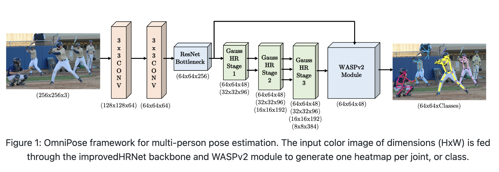
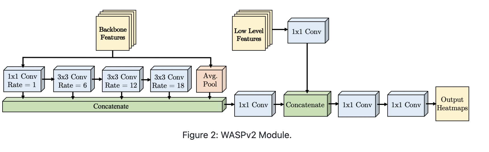
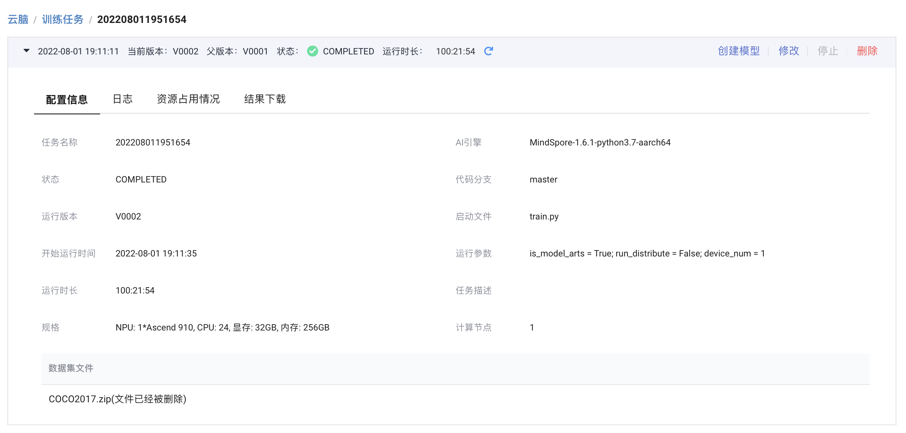
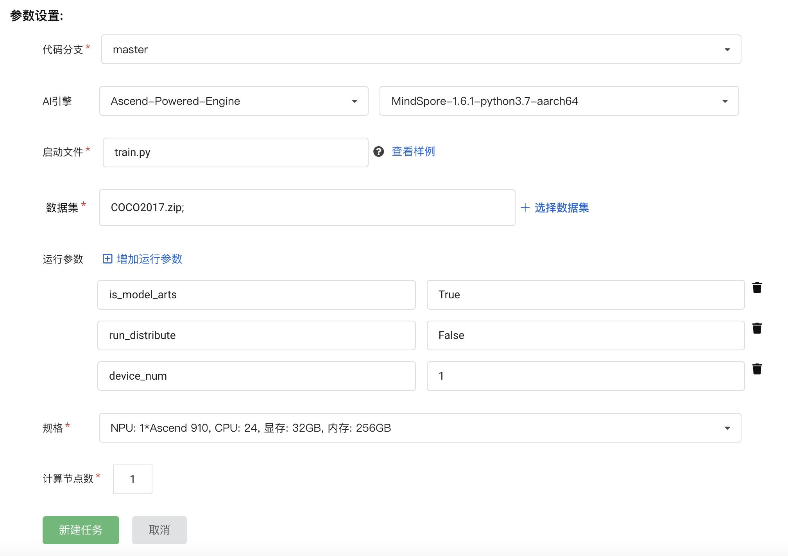
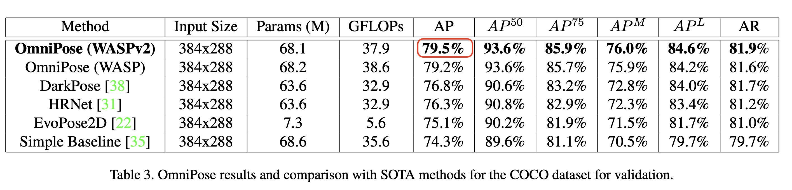
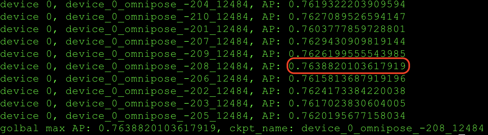

## OmniPose 模型自验报告

> 林丽森 finder4alex@163.com


## 1. 模型简介

### 1.1 网络模型结构简介



论文提出一种用于多人姿态估计的多尺度框架OmniPose。OmniPose框架利用多尺度特征来提高主干特征提取器的有效性，且网络规模并未显著增加，也没有后处理模块。OmniPose框架融合了跨尺度的上下文信息，并在多尺度特征提取器中通过引入高斯热图调制来帮助进行joint坐标点的定位，从而达到目前人体姿态估计精度最优。论文中提出改进的 waterfall 结构 WASPv2，如图2所示。可以在保持特征图高分辨率的情况下增大感受野FOV,这个提升过后的 waterfall 结构称为 waterfall Astrous Spatial pooling（WASPv2），它既扮演特征提取器，也扮演 decoder。




### 1.2 数据集

> 所用数据集地址：https://git.openi.org.cn/kaierlong/Dataset_COCO2017/datasets

使用的数据集：[COCO2017]

- 数据集大小：
    - 训练集：19.56G, 118,287个图像
    - 测试集：825MB, 5,000个图像
- 数据格式：JPG文件
    - 注：数据在src/dataset.py中处理

数据集目录结构如下：

```shell
COCO2017
├── annotations  // 数据标注
│   ├── captions_train2017.json
│   ├── captions_val2017.json
│   ├── instances_train2017.json
│   ├── instances_val2017.json
│   ├── person_keypoints_train2017.json
│   └── person_keypoints_val2017.json
├── train2017  // 训练集
│   ├── 000000000009.jpg
│   ├── 000000000025.jpg
│   ├── 000000000030.jpg
│   ├── 000000000034.jpg
		.
		.
		.
│   ├── 000000581909.jpg
│   ├── 000000581913.jpg
│   ├── 000000581921.jpg
│   └── 000000581929.jpg
└── val2017  // 测试集
    ├── 000000000139.jpg
    ├── 000000000285.jpg
    ├── 000000000632.jpg
    ├── 000000000724.jpg
    .
    .
    .
    ├── 000000581357.jpg
    ├── 000000581482.jpg
    ├── 000000581615.jpg
    └── 000000581781.jpg
```


### 1.3 代码提交地址

暂时提交在启智中，私有未开源。

仓库地址如下：https://git.openi.org.cn/finder4alex/OmniPose


## 2. 代码目录结构说明

代码目录结构及说明如下：

```shell
.
├── LICENSE
├── README.md  // 说明文档
├── src
│   ├── config.py
│   ├── configs
│   │   └── omnipose.yaml  // 配置文件
│   ├── data  // 数据部分
│   │   ├── dataset.py
│   │   └── __init__.py
│   ├── models  // 网络部分
│   │   ├── __init__.py
│   │   ├── omnipose.py
│   │   └── wasp.py
│   ├── network_with_loss.py  // 损失计算
│   ├── OmniPose.py
│   └── utils  // 工具部分
│       ├── callback.py
│       ├── coco.py
│       ├── fn.py
│       ├── inference.py
│       ├── __init__.py
│       ├── nms.py
│       └── transforms.py
└── train.py  // 训练文件
├── eval.py  // 评估文件
├── export.py  // 导出文件
```


## 3. 自验结果（交付精度规格时需要补齐）

### 3.1 自验环境

软硬件环境如下：

- 启智AI引擎：MindSpore-1.6.1-python3.7-aarch64
- NPU: 1*Ascend 910, CPU: 24, 显存: 32GB, 内存: 256GB


**详细环境配置参见下图：**




### 3.2 训练超参数

超参数配置如下：

> 其中data_url由启智平台实际数据地址替换，训练时替换。

```yaml
GENERAL:
  TRAIN_SEED: 1
  EVAL_SEED: 1
  DATASET_SEED: 1
  RUN_DISTRIBUTE: false
  AUTO_DATASET: true
MODELARTS:
  IS_MODEL_ARTS: true
  CACHE_INPUT: '/cache/dataset/'
  CACHE_OUTPUT: '/cache/output/'
DATASET:
  COLOR_RGB: true
  DATASET: 'coco'
  DATA_FORMAT: jpg
  FLIP: true
  NUM_JOINTS_HALF_BODY: 8
  PROB_HALF_BODY: 0.3
  ROOT: '/mnt/data_0002_24t/dataset/COCO/coco_2017'
  ROT_FACTOR: 45
  SCALE_FACTOR: 0.35
  ANNOTATIONS_SET: 'COCO2017/annotations'
  TRAIN_SET: 'COCO2017/train2017'
  TRAIN_JSON: 'COCO2017/annotations/person_keypoints_train2017.json'
  TEST_SET: 'COCO2017/val2017'
  TEST_JSON: 'COCO2017/annotations/person_keypoints_val2017.json'
MODEL:
  INIT_WEIGHTS: true
  NAME: omnipose
  NUM_JOINTS: 17
  PRETRAINED: 'weights/coco/OmniPose_w48_v2/model_best.pth'
  TARGET_TYPE: gaussian
  IMAGE_SIZE:
  - 288
  - 384
  HEATMAP_SIZE:
  - 72
  - 96
  SIGMA: 3
  EXTRA:
    PRETRAINED_LAYERS:
    - 'conv1'
    - 'bn1'
    - 'conv2'
    - 'bn2'
    - 'layer1'
    - 'transition1'
    - 'stage2'
    - 'transition2'
    - 'stage3'
    - 'transition3'
    - 'stage4'
    FINAL_CONV_KERNEL: 1
    STAGE2:
      NUM_MODULES: 1
      NUM_BRANCHES: 2
      BLOCK: BASIC
      NUM_BLOCKS:
      - 4
      - 4
      NUM_CHANNELS:
      - 48
      - 96
      FUSE_METHOD: SUM
    STAGE3:
      NUM_MODULES: 4
      NUM_BRANCHES: 3
      BLOCK: BASIC
      NUM_BLOCKS:
      - 4
      - 4
      - 4
      NUM_CHANNELS:
      - 48
      - 96
      - 192
      FUSE_METHOD: SUM
    STAGE4:
      NUM_MODULES: 3
      NUM_BRANCHES: 4
      BLOCK: BASIC
      NUM_BLOCKS:
      - 4
      - 4
      - 4
      - 4
      NUM_CHANNELS:
      - 48
      - 96
      - 192
      - 384
      FUSE_METHOD: SUM
LOSS:
  USE_TARGET_WEIGHT: true
TRAIN:
  DEVICE_TARGET: 'Ascend'
  DEVICE_NUM: 1
  BATCH_SIZE: 12
  NUM_PARALLEL_WORKERS: 8
  BEGIN_EPOCH: 0
  END_EPOCH: 210
  OPTIMIZER: adam
  LR: 0.0001
  LR_FACTOR: 0.1
  LR_STEP:
  - 140
  - 180
  WD: 0.0001
  GAMMA1: 0.99
  GAMMA2: 0.0
  MOMENTUM: 0.9
  NESTEROV: false
  SAVE_CKPT: true
  CKPT_PATH: './ckpt'
TEST:
  DEVICE_TARGET: 'Ascend'
  DEVICE_ID: 0
  BATCH_SIZE: 12
  COCO_BBOX_FILE: 'data/coco/person_detection_results/COCO_val2017_detections_AP_H_56_person.json'
  # COCO_BBOX_FILE: 'data/coco/person_detection_results/COCO_test-dev2017_detections_AP_H_609_person.json'
  BBOX_THRE: 1.0
  IMAGE_THRE: 0.0
  IN_VIS_THRE: 0.2
  MODEL_FILE: ''
  NMS_THRE: 1.0
  OKS_THRE: 0.9
  # USE_GT_BBOX: true
  USE_GT_BBOX: false
  FLIP_TEST: true
  SHIFT_HEATMAP: false
  POST_PROCESS: true
  BLUR_KERNEL: 11
  NUM_PARALLEL_WORKERS: 2
  OUTPUT_DIR: './results'
DEBUG:
  DEBUG: true
  SAVE_BATCH_IMAGES_GT: true
  SAVE_BATCH_IMAGES_PRED: true
  SAVE_HEATMAPS_GT: true
  SAVE_HEATMAPS_PRED: true
```


### 3.3 训练

### 3.3.1 如何启动训练脚本

训练如何启动：

- 启智平台

模型训练在启智平台完成，完整训练配置如下图所示：



- 本地命令

**如果需要本地训练，可以使用如下命令：**

```shell
python3 train.py --is_model_arts=True --run_distribute=False auto_dataset=False --device_id=0 --device_num=1 --device_target="Ascend"
```


#### 3.3.2 训练精度结果

- 论文精度如下:



- 复现精度如下：

> 为展示方便，将训练日志下载到本地后得到如下输出。



- 精度结果对比

  - 论文精度为：AP: 79.5
- 复现精度为：AP: 76.39（最优值）
- 复现精度误差为：(79.5 - 76.39) / 79.5 ≈ 3.91%


### 3.4 模型推理

推理命令如下：

```shell
python3 eval.py --ckpt_path=${ckpt_file}
```


## 4. 参考资料

### 4.1 参考论文

- [OmniPose: A Multi-Scale Framework for Multi-Person Pose Estimation](https://arxiv.org/abs/2103.10180)


### 4.2 参考git项目

- [bmartacho/OmniPose](https://github.com/bmartacho/OmniPose)


### 4.3 参考文献

- [Body estimation 论文阅读笔记](https://blog.csdn.net/qq_42902997/article/details/122464978)
